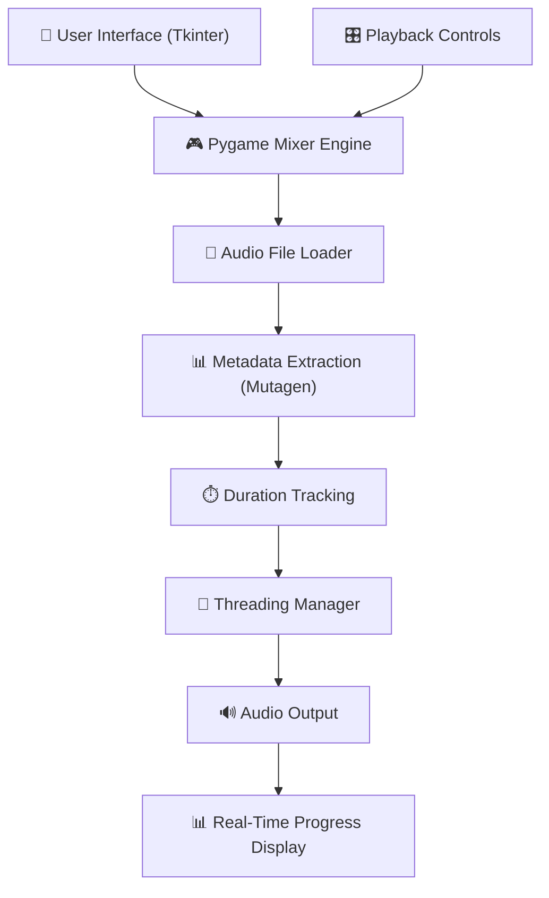

<!-- ============================================ -->
<!--              Music Player Banner             -->
<!-- ============================================ -->

<div align="center">

# 🎵 Music Player

# Python-Based Desktop Audio Playback System

## Play. Pause. Repeat. Enjoy. 🎧

</div>

---

<p align="center">


</p>

---

# 📖 Project Description

The **Music Player System** is a Python-based desktop application that allows users to play, pause, stop, and manage audio files through an intuitive graphical interface. Built with Tkinter and Pygame, this tool supports playlists, volume control, track navigation, and real-time audio duration tracking.

This application is ideal for students, developers, hobbyists, and anyone interested in learning how multimedia applications work in Python.

---

# ✨ Key Highlights

- 🎵 Play / Pause / Stop Controls
- 📋 Playlist Management
- 🎚️ Volume & Mute Controls
- ⏭️ Next / Previous Track Navigation
- ⏩ Forward & Backward Seek
- ⏱️ Total Audio Length Display
- 📊 Current Playing Time Tracker
- 🎨 Attractive Themed Interface
- 📁 Supports MP3, WAV, OGG, M4A
- 🔇 Text-to-Speech Welcome Audio

---

# 🏗 System Architecture

The Music Player follows a modular architecture that combines GUI controls, audio playback engine, metadata extraction, and threading for responsive user interaction.



---

# 🔄 Application Workflow

1. User launches the **Music Player** application.
2. User adds songs to the playlist.
3. User selects a track from the playlist.
4. **Pygame Mixer** loads and plays the selected audio file.
5. **Mutagen** reads MP3 metadata and track duration.
6. **Threading** ensures the user interface remains responsive during playback.
7. User controls playback using:
   - ▶️ Play
   - ⏸️ Pause
   - ⏹️ Stop
   - ⏭️ Next
   - ⏮️ Previous
8. System displays:
   - ⏱️ Current playback time
   - 🎵 Total track duration
9. User adjusts volume or mutes audio as needed.

---

# 📊 Feature Comparison

| Feature | Basic Media Player | Music Player System |
|:---|:---:|:---:|
| Play / Pause / Stop | ✅ | ✅ |
| Playlist Management | ❌ | ✅ |
| Volume Control | Basic | ✅ Advanced |
| Track Navigation | ❌ | ✅ Next / Previous |
| Seek Forward / Backward | ❌ | ✅ |
| Duration Display | ❌ | ✅ |
| Mute Control | ❌ | ✅ |
| Themed Interface | ❌ | ✅ |
| Text-to-Speech Welcome | ❌ | ✅ |
| Multi-Format Support | Limited | ✅ MP3, WAV, OGG, M4A |

---

# ✨ Core Features

## 🎛️ Playback Controls

| Control | Function |
|:---|:---|
| ▶️ Play | Play selected track |
| ⏸️ Pause | Pause current track |
| ⏹️ Stop | Stop playback |
| ⏭️ Next | Skip to next track |
| ⏮️ Previous | Go to previous track |
| ⏩ Forward Seek | Move forward in track |
| ⏪ Backward Seek | Move backward in track |

---

## 📋 Playlist Management

- ➕ Add songs to playlist
- ❌ Delete individual tracks
- 🗑️ Clear entire playlist
- 🎵 Select tracks for playback
- 📃 Dynamic track list display

---

## 🎚️ Audio Controls

- 🔊 Volume slider adjustment
- 🔇 Mute / Unmute toggle
- 🎵 Real-time audio control
- 🎚️ Fine-grained volume adjustment

---

## ⏱️ Duration Tracking

- 🕒 Total audio length display
- ⏰ Current playback timer
- 📈 Real-time progress updates
- 🎵 Accurate MP3 metadata reading

---

## 🎨 User Interface

- Tkinter-based graphical interface
- 🎭 Themed widgets using **ttkthemes**
- 🌙 Professional dark theme
- 🖼️ Custom application icon support
- 📱 Responsive layout

---

## 🧵 Threading Support

- Prevents UI freezing
- Smooth playback experience
- Background audio processing
- Responsive playback controls

---

# 🛠 Technology Stack

| Layer | Technology |
|:---|:---|
| Programming Language | Python 3.11 |
| GUI Framework | Tkinter + ttkthemes |
| Audio Engine | Pygame (Mixer) |
| Metadata Reading | Mutagen |
| Threading | Python Threading |
| Text-to-Speech | Pyttsx3 |
| File Management | OS Module |
| Audio Formats | MP3, WAV, OGG, M4A |
| Version Control | Git & GitHub |

---

# 📂 Project Structure

```text
MUSIC-PLAYER-USING-PYTHON/
│
├── Music.py                             # Main Application Code
├── music player code.py                 # Alternative Version
├── requirements.txt                     # Dependencies
├── README.md                            # Documentation
├── .gitignore                           # Git Ignore
│
├── icon/
│   └── SC Media Player.ico              # Application Icon
│
├── Diagrams.pptx                        # System Diagrams
├── GUI (1).pptx                         # GUI Design
└── GUI.pptx                             # GUI Documentation
```

---

# 📸 Application Preview


The screenshot above demonstrates the Music Player's complete interface—from playlist management and playback controls to volume adjustment and real-time track duration display.

---

# ⚙ Installation

## Prerequisites

- Python 3.11+
- pip

---

### Clone Repository

```bash
git clone https://github.com/Keya3639/MUSIC-PLAYER-USING-PYTHON.git

cd MUSIC-PLAYER-USING-PYTHON
```

---

### Install Dependencies

```bash
pip install -r requirements.txt
```

---

### Run Application

```bash
python Music.py
```

---

### Alternative Version

```bash
python "music player code.py"
```

---

# 🚀 Demo Workflow

| Step | Action |
|:--:|:---|
| 1 | Launch Music Player |
| 2 | Click **Add Songs** |
| 3 | Select a Track |
| 4 | Click **Play ▶️** |
| 5 | Use Pause / Stop / Next / Previous |
| 6 | Adjust Volume Slider |
| 7 | Toggle Mute |
| 8 | Seek Forward / Backward |
| 9 | View Current Time & Total Duration |

---

# 🌟 Why Music Player?

Unlike complex media players, the **Music Player System** demonstrates how **Python**, **Tkinter**, and **Pygame** work together to create a lightweight, responsive, and user-friendly desktop audio player.

This application helps users:

- 🎵 Play and manage music files
- 📋 Build and organize playlists
- 🎚️ Control playback and volume
- 🧵 Experience responsive audio playback using threading
- 📚 Learn multimedia and GUI programming

**Music Player doesn't just play music—it demonstrates multimedia programming.**

---

# 📈 Advantages

- ✅ User-friendly interface
- ✅ Lightweight and fast
- ✅ Runs completely offline
- ✅ Easily customizable
- ✅ Great learning project for GUI + Multimedia
- ✅ Professional themed interface

---

# ⚠️ Limitations

- Does not support online music streaming
- Limited audio format support compared to commercial media players
- Playlist cannot be saved between sessions
- Large audio files may take longer to load
- Depends on external libraries such as Pygame and Mutagen

---

# 🌟 Real-Time Applications

- 🎵 Personal desktop music player
- 📚 Learning project for beginners
- 🎓 Multimedia programming demonstrations
- 🏫 College mini-projects
- 👨‍🏫 Teaching GUI development
- 🚀 Foundation for advanced media player development

---

# 🔮 Future Enhancements

| Phase | Features |
|:---|:---|
| Phase 1 | Save & Load Playlists |
| Phase 2 | Equalizer & Audio Visualizer |
| Phase 3 | Shuffle & Repeat Modes |
| Phase 4 | Lyrics Integration |
| Phase 5 | Album Art Display |
| Phase 6 | Windows Installer (.exe) |
| Phase 7 | Web & Mobile Version |
| Phase 8 | Song Search Functionality |

---

# 🛣 Roadmap

- ✅ Tkinter GUI Development
- ✅ Pygame Audio Integration
- ✅ Playlist Management
- ✅ Volume & Mute Controls
- ✅ Track Navigation
- ✅ Duration Tracking
- ✅ Threading Support
- 🔄 Playlist Save/Load
- 🔄 Equalizer & Visualizer
- 🔄 Cross-Platform Installer

---

# 🎯 Conclusion

The **Music Player System** showcases how Python can be used to develop real-world multimedia applications. By combining **Tkinter**, **Pygame**, and **Mutagen**, this project delivers an intuitive desktop music player while demonstrating concepts such as GUI development, audio processing, threading, and metadata handling.

With future enhancements, it can evolve into a full-featured cross-platform media player.

---

# 👩‍💻 Developer

## Keya Das

**MCA (Artificial Intelligence & Data Science)**

🌐 **GitHub**

https://github.com/Keya3639

📧 **Email**

keyakarunamoydas@gmail.com

---

# 🙏 Acknowledgements

This project was developed using the following open-source technologies and frameworks:

- 🎨 Tkinter
- 🎶 Pygame
- 📊 Mutagen
- 🧵 Python Threading
- 🔊 Pyttsx3
- 🐍 Python
- 🌍 Open Source Community

---

<div align="center">

# 🎵 Music Player

### Play. Pause. Repeat. Enjoy. 🎧

<br>

**Built with ❤️ using**

**Python • Tkinter • Pygame • Mutagen • Threading • Pyttsx3**

<br>

</div>
